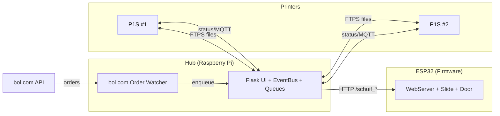
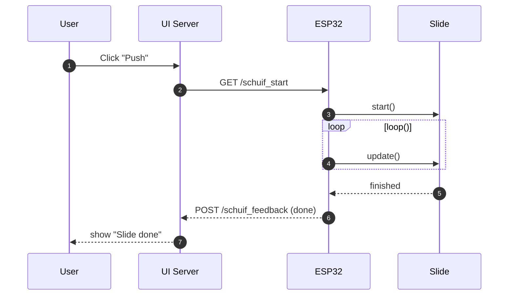
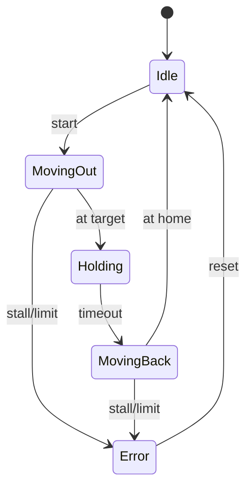
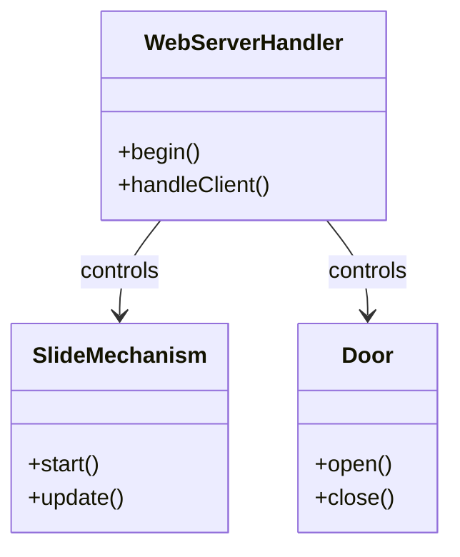
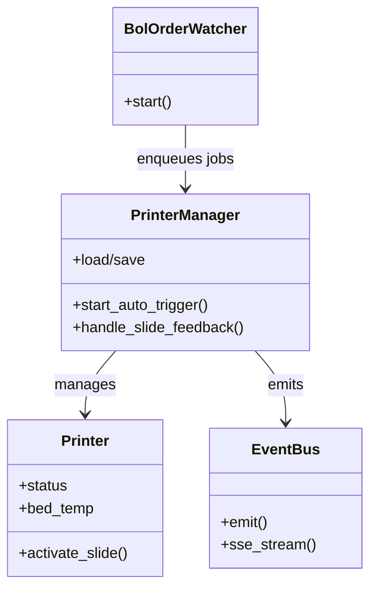
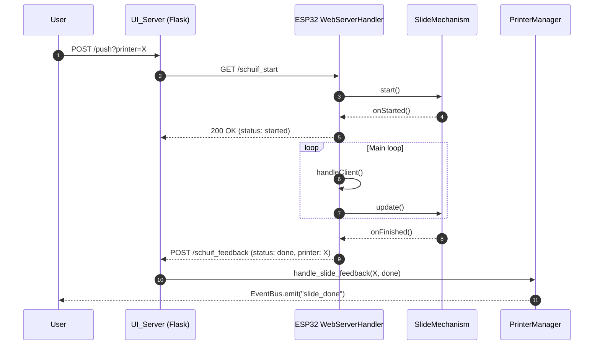
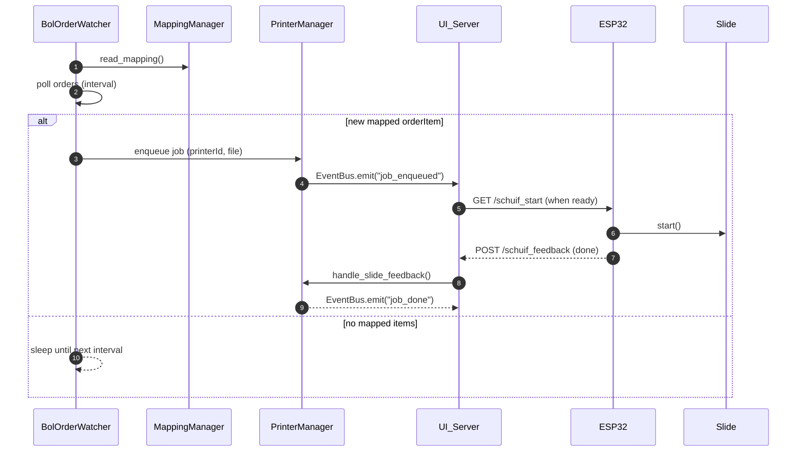
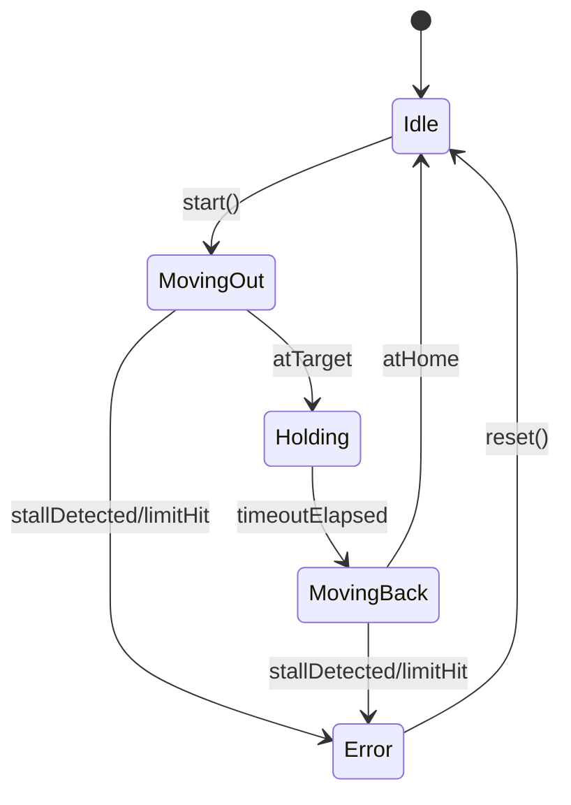

## Introduction

Desktop 3D printers are increasingly used to produce prototypes, educational models and customised products. In many workshops and small production farms the machines stand idle while prints cool and operators manually remove finished objects from the build plate. This downtime limits throughput and requires constant supervision. PrinterSchuif addresses this problem by providing an automated print‑removal and inventory‑management system for 3D printers. The goal is to reduce idle time and support unattended printing by automatically removing prints, managing queues and starting the next job without human intervention.

The solution consists of a lightweight ESP32‑based controller that controls a slide mechanism and a door servo, plus a local web dashboard that monitors printers, manages queues and connects to external order systems. A Raspberry Pi 4 runs the Flask‑based user interface which communicates with the ESP32 via HTTP, MQTT and FTPS. The system supports multiple printers, integrates with bol.com to pull orders based on EAN codes. A fully functional prototype was created and validated in a realistic environment to demonstrate technical feasibility and commercial potential.

## Case description

This project was developed to streamline the post‑processing workflow in personal and business 3D printing environments. To understand the needs of potential users, there has been market research done by surveying print farm operators and 3D printing companies about their current processes, challenges and desired improvements. The research revealed a clear demand for scalable, affordable automation that could reduce downtime, simplify print removal and support inventory management. Operators wanted to avoid repeatedly visiting machines to remove prints.

Based on this needs analysis the functional specifications were divided into mechanical, software and commercial categories and prioritised using the MoSCoW method. Examples of must‑have requirements include automatic removal of prints, an adjustable slide that stays outside the printer’s motion envelope, automatic door control, multi‑printer monitoring and queue management, and integration with bol.com orders via EAN codes. The result is a clear set of requirements that directly address the pain points uncovered during the market research and which guided the system architecture and implementation.

## System architecture

---------------------------------------
## Hardware overview

The mechanical part of the PrinterSchuif combines an adjustable slide mechanism driven by stepper motors with a door module driven by a servo (MG996R). The slide can adapt to the height of the build plate and retracts completely outside the motion envelope of the printer when idle. Limit switches and TMC2209 motor drivers with StallGuard provide reliable position feedback and impact detection so that jams can be detected and handled. A metal frame supports the mechanism and attaches to the printer without significantly increasing its footprint.

At the core of the electronics is an ESP32‑C3 microcontroller equipped with Wi‑Fi and UART. It controls the stepper motors via TMC2209 drivers and the door servo directly. The firmware exposes HTTP endpoints for commands, maintains a non‑blocking state machine to handle motion and retries, and publishes status information over MQTT. Wi‑Fi credentials and API keys are stored in example header files that are excluded from version control to protect sensitive data.

The proof‑of‑concept is compatible with the Bambu Lab P1S printer without modifications and is designed to be extensible to other models. A regulated power supply powers the microcontroller and motors, ensuring stable operation without excessive heat.

## Software overview

On the software side the solution consists of two major layers: a controller layer on the ESP32 and a web/UI layer on the Raspberry Pi. The controller firmware is written in modern C++ and encapsulates the hardware logic into Door, SlideMechanism and WebServerHandler classes. The firmware implements a non‑blocking state machine to move the slide out, wait for the part to drop and then retract, while monitoring StallGuard feedback to detect jams. A configurable Debug.h header enables or disables detailed serial logging.

The web/UI layer runs on a Flask server hosted on a Raspberry Pi 4. It provides dashboards to monitor multiple printers, upload files via FTPS, manage per‑printer queues, configure activation temperatures and assign files to EAN codes. It communicates with the printers via MQTT for status updates and HTTP for slide and door commands. Server‑Sent Events (SSE) push real‑time updates to the browser. A Printer class stores the state of each printer, while a PrinterManager orchestrates auto‑trigger loops that detect when a print finishes, wait until the bed is below a safe temperature and then trigger the slide. An optional BolOrderWatcher polls the bol.com API to map EAN codes to print jobs.

The web/UI layer uses Flask and JavaScript to provide a dashboard that lists printers, queues print jobs and displays real‑time events via Server‑Sent Events. The Printer class stores the state of each printer and offers actions such as open_door(), close_door() and activate_slide(). A PrinterManager loads printers from disk, starts MQTT clients to monitor them and runs an auto‑trigger thread that checks when a print has finished, waits for the bed to cool to the required temperature and then activates the slide.

## Class diagram

The following Mermaid diagram summarises the relationships between the main classes. Interfaces and composition are used throughout to keep responsibilities narrow and to make the system easy to extend.

---

### Sequence – Push cycle

This diagram shows the steps when a user presses the Push button in the UI. It captures the interaction between the UI, the ESP32 firmware, and the slide mechanism.

---

### State machine – Slide

The slide itself is modelled as a state machine. This diagram shows how it moves from idle, to extending, to retracting, and how errors are handled.

---

### Class diagram – Firmware (ESP32)

This class diagram shows the key firmware classes. The WebServerHandler controls both the SlideMechanism and the Door, and exposes their functions through HTTP endpoints.

---

### Class diagram – UI (Raspberry Pi)

On the server side, the main classes are shown below. PrinterManager is central: it manages printers, emits events, and handles incoming jobs from the BolOrderWatcher.

## Sequence diagram

The next two sequence diagrams show typical workflows: first the user-initiated push cycle, and then the order-driven flow when bol.com jobs are enqueued automatically.

## State machine

The slide mechanism is modelled as a finite‑state machine. Explicit states prevent race conditions and make it easy to extend with new behaviours such as pausing, resuming or error recovery. The following diagram shows the major states and transitions.

## Requirements

The system requirements were derived from user stories, market research and a comprehensive functional specification. They were formalised using the FURPS+ and MoSCoW frameworks so that every requirement is Specific, Measurable, Achievable, Relevant and Time‑bound.

## Functional requirements

- The solution must remove a print automatically when it has finished, without requiring user intervention 
- It must detect when a print has finished via  MQTT and wait until the bed has cooled below a configurable threshold before moving the slide. 
- The web interface shall allow operators to add printers, upload files and manage a per‑printer queue. 
- An optional integration with bol.com shall poll orders every two minutes and enqueue prints according to the EAN mapping.

### Quality attributes

| FURPS+ category | Description | MoSCoW priority |
|-----------------|-------------|-----------------|
| **Functionality** | The product shall automatically remove finished prints from the build plate using a slide that can adjust to the bed height and retract completely outside the printer’s motion envelope. It shall open and close the printer door automatically, manage per-printer queues and start the next print once the previous job is removed and the bed has cooled to a configurable temperature. Multiple printers (minimum 3) can be controlled from a single hub, and print jobs can be enqueued automatically based on EAN codes from bol.com orders. | Must |
| **Usability** | The web interface shall be intuitive, support dark mode and run on both desktop and mobile browsers. Operators shall be able to upload files, assemble queues, monitor status and adjust activation temperatures without technical knowledge. A user manual should be provided to simplify installation and operation. | Should |
| **Reliability** | The system shall detect jams and stalls via StallGuard and limit switches and handle them gracefully by retrying actions or reporting errors. It shall reconnect to Wi-Fi after temporary outages, log incidents and persist processed order IDs to avoid duplicates. The slide and door must operate reliably across hundreds of cycles. | Must |
| **Performance** | The web interface shall update printer status at least every 3 seconds, and the order watcher shall process new orders within 3 minutes. The hub shall support concurrent control of at least 3 printers, with a goal of scaling to 30 printers. | Should |
| **Supportability** | The firmware and server software shall follow SOLID design principles and be modular so that new features (e.g. active cooling, vision-based checks or additional e-commerce integrations) can be added easily. All constants shall reside in a central configuration file. The design shall be scalable to other printer models beyond the Bambu P1S. | Must |
| **Security/Privacy** | Wi-Fi credentials, FTPS credentials and API keys shall not be committed to the repository; example files illustrate where to put secrets. Communications shall use authenticated sessions and local network access. Only authorised users can access the dashboard. | Must |

In the firmware, the slide is driven by stepper motors controlled through TMC2209 drivers. The SlideMechanism class configures acceleration profiles using the AccelStepper library, monitors StallGuard registers for impact detection and adjusts the motion state accordingly. It uses limit switches to reference the home position and stores the current state (Idle, MovingOut, Holding, MovingBack or Error) in a finite‑state machine. A global debug flag toggles serial logging to avoid impacting performance in production. The Door class wraps the MG996R servo control, providing non‑blocking open() and close() methods and returning immediately so the main loop can continue running. All hardware constants—pin assignments, travel distances, timing values and activation temperatures—are defined in Config.h so they can be tuned centrally.

On the server side, the Flask application is split into modules for configuration management, event handling, printer management, queue management and bol.com integration. The code follows the Single Responsibility Principle: for example, mapping_manager.py handles only EAN mappings and does not know about printers or orders. Dataclasses such as Printer store state explicitly and make type annotations clear. For each printer the PrinterManager launches a background thread implementing the auto‑trigger loop: it subscribes to MQTT topics for status updates, polls bed temperatures, waits until the temperature is below the configured threshold and then issues a slide command via HTTP. After the slide reports completion via feedback endpoints, the manager clears flags, closes the door and starts the next file in the queue. The web UI uses Bootstrap and Tailwind CSS for styling, runs real‑time updates via SSE and persists user preferences (e.g. dark mode) in a JSON configuration file. Files are transferred to printers via FTPS to preserve compatibility with Bambu’s built‑in file storage.

## Testing and validation

The prototype was evaluated both in the lab and in a business implementation at Nillie, a 3D printing company that operates multiple Bambu Lab P1S printers. There have been performed reproducible tests to confirm that the slide could remove prints reliably after cooldown and to fine‑tune the activation temperature. However, the most meaningful validation came from the business implementation.

At Nillie, the system was deployed on two printers and ran largely unattended for several days. Incoming orders were retrieved from bol.com, matched to the correct models via EAN mappings and automatically added to each printer’s queue. Once a print finished and the bed cooled below the configured temperature, the slide mechanism removed the print and the door closed automatically. The next job in the queue then started without human intervention. All key functional requirements were achieved in this pilot: automatic removal, parking outside the motion envelope, automatic door control, multi‑printer dashboard, automatic activation based on status and bed temperature, queue management with continuation, feedback and logging, and integration with bol.com via EAN mapping.

During the pilot the system detected and reported incidents such as stalled slides or incorrect temperature settings through the UI, enabling operators to intervene when necessary. Logs from MQTT and HTTP confirmed that no events were missed. The pilot demonstrated that the solution can reduce downtime and enable unmanned operation in a real production environment. Some requirements, however, remained open: mounting without additional footprint, scalability beyond Bambu models, active cooling, a 30‑printer scale test, vision‑based part verification, integrations with Shopify/Amazon and a detailed user manual are planned for future development.

## Reflection and future work

Developing PrinterSchuif highlighted the benefits of modular design and disciplined engineering practices. By isolating hardware control in C++ classes and decoupling the web front‑end, we were able to iterate quickly and test each component independently. Feedback from online communities and early adopters significantly influenced the interface design, automation logic and prioritisation of requirements. The PoC demonstrates that an automated slide mechanism can reliably remove prints and reduce turnaround time. Nevertheless, several areas require attention before the product is commercially ready:

- Mechanical integration without extra footprint: the current prototype requires some additional space around the printer. Redesigning the mounting points and integrating the mechanism into the printer enclosure could eliminate this footprint.
- Active cooling: the ability to accelerate the bed cooldown via fans or ducts would further reduce cycle times.
- Extended stress testing: the tests performed were sufficient to prove functionality but not to cover all failure conditions. Long‑term testing with different materials, printer models and load scenarios is recommended.
- Usability improvements: the UI is functional but can be more intuitive. Incorporating user feedback to add visual warnings, step‑by‑step configuration and mobile optimisation will enhance adoption.
- Scalability and integrations: the current system supports a handful of printers and bol.com. Scaling up to 30 printers, integrating with other e‑commerce platforms (Shopify, Amazon) and adding vision‑based checks or RFID could unlock new markets.

- Addressing these points in the next development cycle will help transform the prototype into a robust, reproducible and marketable product.

## Conclusion

This project delivers a working proof‑of‑concept for automated 3D print removal and demonstrates how thoughtful application of object‑oriented design and smart requirements. By addressing functional needs, quality attributes and technical design, PrinterSchuif offers a practical solution to streamline 3D print workflows and serves as a solid foundation for further innovation.